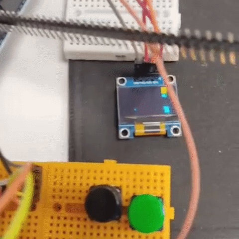

# 🎮 Arduino Mini Oyun Konsolu

Bu proje, **Arduino üzerinde çalışan çoklu oyun platformu** niteliğindedir. Basit bir **OLED ekran** üzerinde oynanabilen farklı oyunlar barındırır. Proje, sınırlı donanım kaynaklarıyla bile oyun geliştirmenin mümkün olduğunu kanıtlayan eğlenceli bir örnektir.  

---

## 🎥 Oynanış Örneği



---

## 🕹️ İçerdiği Oyunlar

### 🐍 Yılan Oyunu
- Klasik Snake oyununun minimalist versiyonu.  
- Oyuncu yön tuşları ile yılanı kontrol eder.  
- Yemleri yedikçe yılan uzar, ekran alanı daralır ve zorluk artar.  

### 🏃‍♂️ Dino Run (Engellerden Kaçış)
- Google Chrome’daki dinozor oyununa benzer bir koşu oyunu.  
- Oyuncu, engelleri zıplayarak aşmak zorundadır.  
- Zaman ilerledikçe hız artar.  

### 🎯 Reaksiyon Oyunu
- Oyuncunun reflekslerini ölçen basit bir oyun.  
- Ekranda rastgele beliren işaretlere en hızlı şekilde tepki verilmesi gerekir.  

### 🎲 Rastgele Mini Oyunlar
- Kod içerisinde tanımlanmış küçük oyun modülleri de bulunabilir (örn: tahmin, sayı yakalama, basit labirent).  
- Amaç, OLED ekranın sınırlarında farklı oyun deneyimlerini test etmek.  

---

## 📂 Proje Yapısı

```
.
├── arduinooyun.ino   # Tüm oyunların bulunduğu Arduino kodu
├── output.gif        # Oynanış demosu (kullanıcı yükleyecek)
└── README.md         # Proje açıklaması
```

---

## ⚙️ Donanım Gereksinimleri

- Arduino (Uno, Nano veya uyumlu bir model)  
- 128x64 OLED ekran (I2C)  
- Butonlar (oyun kontrolü için)  
- Breadboard + jumper kablolar  

---

## 🚀 Kurulum

1. Arduino IDE’yi indir ve kur.  
2. Gerekli kütüphaneleri yükle:  
   - `Adafruit_GFX`  
   - `Adafruit_SSD1306`  
3. `arduinooyun.ino` dosyasını aç ve Arduino kartına yükle.  

---

## ▶️ Oynanış

- Arduino açıldığında oyun menüsü gelir.  
- Butonlar ile oyun seçilir ve başlatılır.  
- Oyun sırasında skor ekranda gösterilir.  
- `RESET` ile ana menüye dönülür.  

---

## 📊 Kullanım Alanları

- 🎓 **Eğitim** → Basit oyun geliştirme mantığını öğretmek için.  
- 🕹️ **Eğlence** → Minimalist donanımda retro tarz oyun keyfi.  
- 🔬 **Araştırma** → Mikrodenetleyicilerle kullanıcı arayüzü geliştirme denemeleri.  
